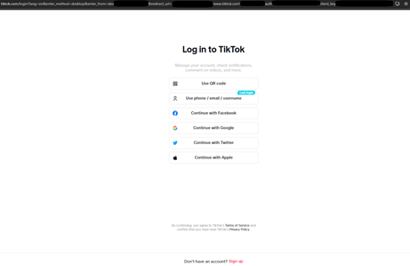

# TikTok OAuth Uploader

This project provides a simple solution for TikTok OAuth authorization and video upload orchestration. 
It consists of two main components: a web server for handling TikTok OAuth authorization and a process to automate video uploads using the obtained tokens.
 
## Overview
### Web Server

A Flask web server to handle TikTok OAuth authorization and token management. The app directs users to TikTok's authorization page to get user consent for TikTok to provide an authorization code that allows the app access to their requested permissions. The app then exchanges the authorization code for a scoped access token that can be used to interact with the TikTok API on the user's behalf. 


### Upload to TikTok
To manage the process of uploading videos to TikTok using a scoped access token with the user's authorization. The script follows TikTok's Direct Post API and Media Transfer guidelines to ensure proper video upload and management.

## Features
- **OAuth Authorization**: Redirects users to TikTok for login and authorization.
- **Token Management**: Handles access token retrieval, refreshes tokens, and manages token expiration.
- **Secure Authentication**: Implements PKCE (Proof Key for Code Exchange) for enhanced security during the authorization process.
- **Local Storage**: Stores token data locally in a JSON file for easy management and retrieval.
- **Video Upload Initialization**: Initiates the video upload process by requesting an upload URL from TikTok.
- **Chunked Video Upload**: Splits video files into chunks for upload, adhering to TikTok's media transfer guidelines.
- **Creator Profile Management**: Queries the creator's profile settings to ensure the upload metadata aligns with the user's preferences.

## Setup:
You will need a TikTok developer account and connect an app through the developer portal to get the:
- Client key
- Client secret

To use the automated posting script, each post should include the following in 'videos_to_upload.json'  
Example: 
```
[
  {
      "user_id" : "TIKTOK_USER_OPEN_ID", 
      "video_path" : "PATH_TO_VIDEO1",
      "description" : "DESCRIPTION1",
      "tags" : ["#TAG1", "#TAG2"]
  },
]
```


## Installation
```
pip install -r requirements.txt
```

## Usage
### Flask web server
1. Start the web server:

```
python app.py
```

- Visit http://localhost:8000 and click on "Login with TikTok" to begin the authorization process.

<!--  -->

<p align="center">
  
</p>

When complete, a `user_tokens.json` file will be created containing the access and refresh token for the user.

### Tokens
The access token is valid for 24 hours but the refresh token is valid for 365 days and can be used to refresh the access token with the same scope without needing the user to go through the OAuth flow again.

1. To refresh a token, visit [/refresh_tokens/](/refresh_tokens/).
2. Or, add `check_and_refresh_tokens()` to the upload script.

### Upload to TikTok

1. Run the following to upload each video listed in 'videos_to_upload.json'.
```
python upload_to_tiktok.py
```
This will first retrieve the access token from `user_tokens.json` for the listed user and upload the video.

## Notes
This project was intended for personal use specifically for content posting so it focuses on functionality with minimal styling considerations. It provides the essential code needed to integrate TikTok OAuth and interact with the TikTok API. For more robust data storage, consider replacing the JSON file with a database solution and a better data retention approach.

## References
[TikTok Documentation](https://developers.tiktok.com/doc/overview/)
- [Login/Authorization Kit](https://developers.tiktok.com/doc/login-kit-desktop/)
- [OAuth Token Management](https://developers.tiktok.com/doc/oauth-user-access-token-management/)
- [Content Posting API](https://developers.tiktok.com/doc/content-posting-api-reference-direct-post/)
- [Media Transfer Guideline](https://developers.tiktok.com/doc/content-posting-api-media-transfer-guide/)